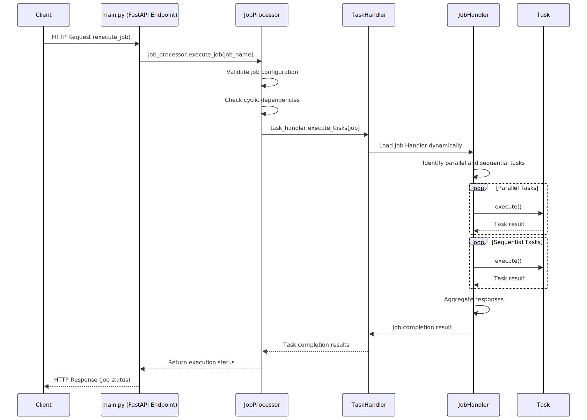

# FastAsyncio Project

## 1. Project Description

**FastAsyncio** is an asynchronous task orchestration framework that allows for running tasks both in parallel and sequentially. It provides a flexible architecture for dynamic task execution using Python's asyncio capabilities. The framework supports dynamically loading tasks, handling dependencies, and ensuring efficient execution of tasks with proper error handling and logging. 

FastAsyncio also integrates with **FastAPI** to expose endpoints for initiating task orchestration via an HTTP API, enabling easier interaction with external systems. This makes the project suitable for web-based task management systems, allowing clients to trigger task workflows asynchronously through FastAPI endpoints.

## Seqeunce Diagram


## 2. File Descriptions and Usage

### 1. `main.py`
- This file acts as the entry point of the project.
- It initializes the orchestrator and potentially sets up FastAPI endpoints for task management.

- **Usage**:
  ```bash
  python main.py

### 2. `job_processor.py`
- This file is the validator job configuration like valid json, job defiition exist and cyclic dependency check 

### 3. `task_processor.py`
- This file dynamically lods Handler class for a job and identified paralle and sequential tasks

### 4. `generic_job_handler.py`
- Contains the `GenericJobHandler` class responsible for managing task execution.
- Supports both parallel and sequential task execution, with an option to load task classes dynamically.
- Includes methods for running parallel and sequential tasks, and for aggregating task responses.

### 5. `task1.py`
- Defines `Task1`, a sample task that extends `BaseTask`. This class demonstrates how a task should be implemented with an `execute()` method that can accept input and return output.
- Tasks in this framework are async, and `Task1` simulates task execution with a 1-second delay.

### 6. `job1_handler.py`
- Extends the `GenericJobHandler` class.
- `Job1Handler` is specific to a particular job and logs its own class name before invoking the parent’s `run()` method.

## 3. How to Test the Module

To test this module, you can follow these steps:

1. Ensure that all Python files are in the appropriate directories as per the project structure.
2. Create or modify a JSON file to define the tasks and job configurations.
3. Set up **FastAPI** to expose the orchestration as an API and test via HTTP requests.
5. Run the script using the Python command:
    ```bash
    python main.py
    ```
6. You can customize and add your tasks in the `task_handler.py` and link them to a handler class in the `job1_handler.py`.

Additionally, ensure logging is enabled to track the execution flow and output.

## 4. Naming Conventions/Assumptions

- Job handler modueles and classed should be defined in joborchrestrator/handler folder
- Tasks should inherit from a base task class, e.g., `BaseTask`, and be placed in the `job/task` directory for dynamic loading.
- Task class name and python file name should have same name, Task Class is in Pascal case where python file name is all in lower case. 


## 5. Project Structure

The following project structure is assumed:

```
fastasyncio/
│
├── src/                                # Contains all the source code for the project.
│   ├── __init__.py                     # Initializes the `src` directory as a Python package
│   ├── job/                            # Houses job and task-related modules.
│   │   ├── __init__.py                 # Marks the `job` directory as a Python package.
│   │   └── task/                       # Contains definitions and implementations of various tasks.
│   │       ├── __init__.py             # Marks the `task` directory as a Python package
|   │       ├── base_task.py            # Defines a base class for all tasks
|   │       ├── tas1.py                 # Implements a specific task, extending from `base_task.py`
│   │       ├── task2.py                # Implements another specific task, showcasing variety in task functionality.
│   │       └── task3.py                # Another task implementation, part of the diverse set of tasks this project can handle.
│   │       └── task4.py                # Continues to expand the task variety within the project.  
│   ├── joborchrestrator/               # Responsible for orchestrating the execution of jobs.
│   │   ├── __init__.py                 # Marks the `joborchestrator` directory as a Python package.
|   │   ├── job_processor.py   # Contains the `JobOrchestrator` class that manages the scheduling and execution of different jobs.
|   │   ├── task_processor.py   #  Manages the execution of tasks, utilizing the classes defined in the `task` directory.
|   │   ├── utils.py          # Provides utility functions such as configuration loading and cycle detection in task dependencies.
│   |   └── handler/                    # Contains handlers for different types of jobs.
│   │       ├── __init__.py             # Marks the `handler` directory as a Python package.
│   │       ├── generic_job_handler.py  # Provides a generic handler that can be extended to create specific job handlers.
│   │       └── job1_handler.py   # A specific implementation of a job handler, tailored for a particular type of job 
│   ├── main.py   # Serves as the entry point for the application, running the job orchestrator or a FastAPI server.
│
├── configs/                            # Stores configuration files.
│   ├── job_config.json                 # Provides examples of job configurations that the orchestrator can process.
│   └── schema.json          # Defines a JSON schema for validating the job configuration files
│
├── docs/                              # supporting documents and artifcats for project.
│   └── images/                        # images to be used for project docuemntation 
│
└── requirements.txt  # Python dependencies required by the project, installed using `pip install -r requirements.txt`.

```


