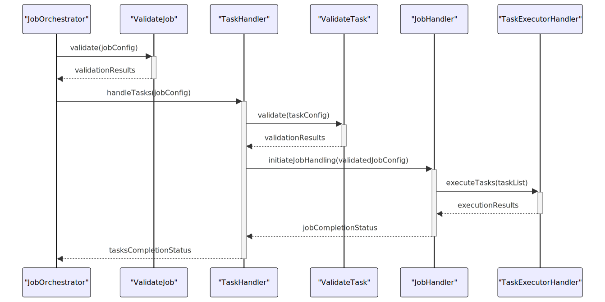

# TaskOrchestrator Project

## Overview

The TaskOrchestrator project is designed to dynamically manage and execute tasks based on configurations specified in JSON files. It is ideal for environments that require sophisticated task management and execution strategies, such as workflow engines, batch processing systems, or automation frameworks. The system leverages Python's dynamic importing capabilities to load task handlers on the fly, allowing for flexible execution of tasks based on runtime configurations. It uses a `ThreadPoolExecutor` for managing parallel execution of tasks and handles dependencies to ensure tasks are executed in the correct order.

## Architecture



## Seqeunce Diagram


## Project Structure

The project is structured into several Python files, each serving specific roles:

- **`job.py`**
  - **Purpose:** Defines the `Job` class that encapsulates details and operations for a single job.
  - **Functionality:**
    - Manages individual tasks within a job, including setup and teardown operations.
    - Coordinates between different task handlers.

- **`task_handler.py`**
  - **Purpose:** Handles the dynamic loading and execution of individual tasks.
  - **Functionality:**
    - Dynamically imports the specified task handler module and class.
    - Executes tasks and manages the passing of dependency results.

- **`generic_job_handler.py`**
  - **Purpose:** Provides a base class for handling the execution of tasks, including parallel and sequential processing.
  - **Functionality:**
    - Manages parallel execution of tasks using `ThreadPoolExecutor`.
    - Handles task dependencies to ensure correct execution order.

- **`job1_handler.py`**
  - **Purpose:** Extends `GenericJobHandler` to cater to specific requirements of 'Job 1'.
  - **Functionality:**
    - Customizes task preparation, execution, and cleanup specific to 'Job 1'.

- **`utilities.py`**
  - **Purpose:** Offers utility functions to support task handlers and job management.
  - **Functionality:**
    - Includes functions for setting up logging and converting string formats.
    - Provides a method to check for cyclic dependencies among tasks.

## Configuration Files

- **`job_config.json`**
  - **Purpose:** Stores configuration details for jobs to be executed by the orchestrator.
  - **Structure:**
    - Each job configuration is a JSON object with properties such as `name`, `handler`, and `tasks`.
    - `handler` specifies the Python module and class responsible for handling the job.
    - `tasks` is an array of task configurations, each detailing task-specific settings and dependencies.

  - **Example Configuration:**

    ```json
    {
      "jobs": {
        "example_job": {
          "handler": "job_orchestrator.handlers.job1_handler",
          "tasks": [
            { "name": "jobs.job2.task4"},
            { "name": "jobs.job2.task5", "dependencies": ["jobs.job2.task4"] },
            { "name": "jobs.job2.task6" }
          ]
        }
      }
    }
    ```

## Example Usage

Assuming a `main.py` file that serves as the entry point for running jobs:

```python
from job_orchestrator.job import JobOrchestrator

def main(job_name):
    # Load job configuration from JSON    
    config_file = 'config/job_config.json'
    schema_file = 'config/job_schema.json' 
    # Create a Job instance
    job = JobOrchestrator(config_file, schema_file)
    
    # Execute the job with the specified tasks
    # Initialize the JobOrchestrator with the configuration path
    orchestrator = JobOrchestrator(config_file, schema_file)
    orchestrator.start_job(job_name)

if __name__ == "__main__":
    job_name = 'job1'  # Name of the job to be executed
    main(job_name)
```

## Naming Convention

### Handler Files and Class Names
- **File Names:** Should be in snake case format (e.g., `job1_handler.py`).
- **Class Names:** Should be in PascalCase format (e.g., `Job1Handler`).

### Task Files and Class Names
- **Task Files:** Located in `/job/<job_name>` should follow the naming convention where the file name is in snake case format (e.g., `task1.py`).
- **Class Names:** Within these files should be in PascalCase format (e.g., `Task1`).

### `job_config.json` Rules
- **Handler Node Value:** Should be the fully qualified name from `job_orchestrator` to the Python file name (e.g., `job_orchestrator.handlers.generic_job_handler`).
- **Task Name:** Should be the fully qualified name from `jobs` to the task Python file name (e.g., `jobs.job2.task4`).
- **Child Nodes:** `jobs` node in json we should have child node with same name as the folder under `jobs`.

## Project Structure
```plaintext
ProjectName/
│
├── src/                                # Source files for the project
│   ├── __init__.py                     # Makes src a Python package
│   ├── main.py                         # Entry point of the application
│   ├── job_orchestrator/               # Task orchestrator module
│   │   ├── __init__.py
│   │   ├── job.py                      # Job orchestrator class
│   │   ├── task_handler.py             # Task handler class
│   │   ├── utilities   .py             # Utility functions and classesTask handler class
│   │   └── handlers/                   # Handlers for different types of tasks
│   │       ├── __init__.py
│   │       ├── generic_job_handler.py  # Generic task handler
│   │       └── job1_handler.py         # Specific task handler for special tasks
│   │
├── tests/                              # Unit and integration tests
│   ├── __init__.py
│   ├── test_main.py                    # Tests for the job orchestrator
│   ├── job_orchestrator/               # Task orchestrator module
│   │   ├── __init__.py
│   │   ├── test_job.py                 # Tests for Job orchestrator class
│   │   ├── test_task_handler.py        # Tests for Task handler class
│   │   ├── test_utilities   .py        # Tests for Utility functions and classesTask handler class
│   │   └── handlers/                   # Handlers for different types of tasks
│   │       ├── __init__.py
│   │       ├── test_generic_job_handler.py  # Tests for Generic task handler
│   │       └── test_job1_handler.py         # Tests for Specific task handler for special tasks
│   │
├── docs/                           # Documentation files
│   └── images/                     # Image for readme.md file
│
├── README.md                   # Detailed project documentation
├── .gitignore                      # Specifies intentionally untracked files to ignore
└── requirements.txt                # List of project dependencies

```
